### 《致波特兰的一封信》

 

亲爱的波特兰：

你知道我是怎么确认交易消息的吗？

我没被Woj或Shams的推特轰炸，也没有被100条朋友和家人短信吓醒。事实上，没有任何闹剧发生，我知道一切事情的进展。

尽管商业联盟有时会非常疯狂和冷血，但在这次交易中一切都非常公开、透明与诚实。

这就是我与开拓者之间的羁绊。我们彼此清楚，尽管拥有美好的过去，但故事将在这里迎来终章。

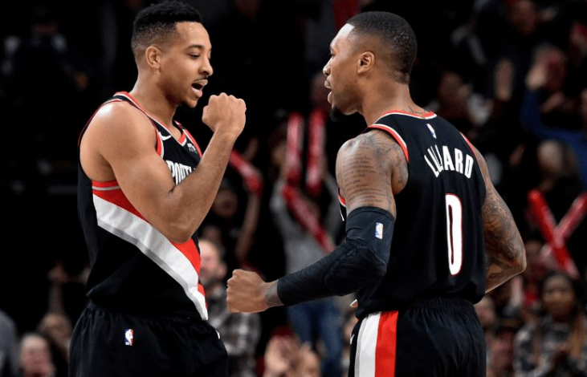

感谢克里斯-海耶斯（NBC评论员）的好意，但内情必须由我来说。因为这是非常私人化的事情，只有这样才是正确的。

有趣的是，交易达成的前一晚，我和利拉德在更衣室有说有笑，正当我要走进浴室的时候，我的手机响了。

如果了解我的话，你就知道除了临近交易截止日，我通常都开着勿扰模式。我将我的经纪人列入了白名单，所以无论如何他的电话我都能接到。

因此当手机响起时，铃声听起来就像恐怖电影里的一样。大家都停下手中的事，我看了我的手机，确实是我经纪人的电话。利拉德看向我，眼神仿佛在说，“我的天，真的发生了？”

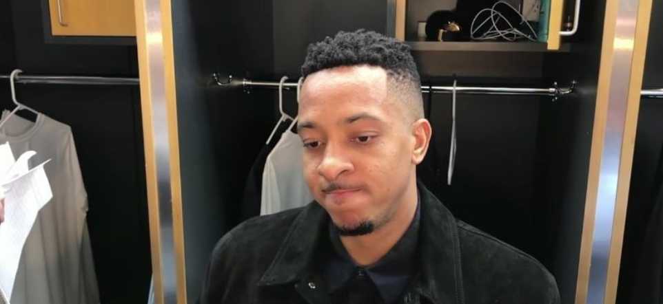

我们已经深陷交易流言很久了，以至于这对我们来说就像是玩笑。我们谈过很多，因为流言太多了，我们甚至不会太在意。

我的第一反应是：“让我看看发生了什么，我很快就回来。”我的经纪人告诉我，鹈鹕参与了交易，但还没有最终完成，他让我守口如瓶。

所以我回到更衣室里说：“暂无消息，兄弟，我还在这儿！”

是不是很像华尔街之狼的作风，我仿佛小李子一样，“我不会滚蛋！一切照常！”

我们都在笑，要不然还能怎么样呢？

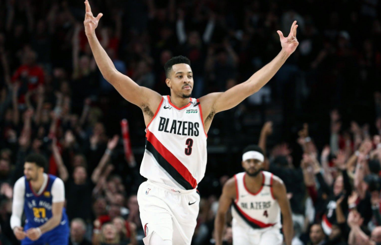

显然，当我晚上离开那栋楼时，我清楚这可能是我们在一起的最后时光。

但是，能够按照我自己的方式离开，而不是在所有人面前接到电话，或者有人来把我从训练中叫出来，这就很完美了。

我们家里有一个1个月大的宝宝，所以我和妻子都很难有深度睡眠，第二天早上6点我就和妻子起床喂奶。老实说，感觉有点舒服和惬意。

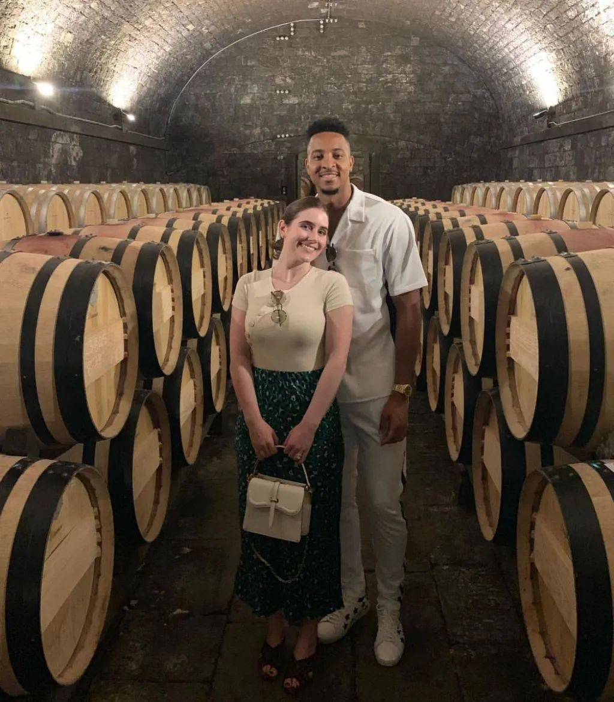

因为我们坐在自己的房子里，在这个我们热爱的城市里。太阳还没有升起，我半睡半醒，手里抱着我的儿子，所有父亲都明白这样的时刻难以用语言形容。

就在那时，我的手机响了，清晨6点的电话，不用猜都知道是谁。

我接通电话，经纪人告诉我交易达成，我将前往鹈鹕，新闻几分钟后就会发布，让我做好准备。

当时我和妻子坐在那里，小宝宝不哭不闹，屋里一片平和，我的手机也没开始响。我和妻子对视着，眼神仿佛在说，“好吧，那现在该干些什么？”

这一切绝不只是生意，波特兰是我的家。在同一个地方待了9年，你不可能不受到影响。我指的不是篮球，而是灵魂。

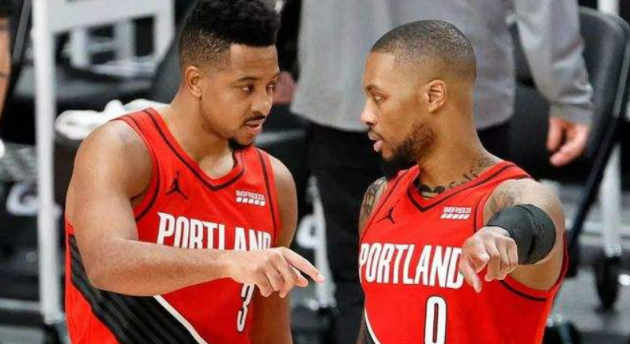

我还没想好如何跟大家道别。

交易后的那个晚上，我来到更衣室取球鞋等一切我的东西，那里空无一人。这有点太不真实了，我不知道他们打包东西会有多快，但当我走进更衣室时，我的名牌已经全部被摘下来了。装备经理已经把我的东西叠好并放在我的位置前。（感谢埃里克和科里，我会怀念你们的。）

我本来想在每个人的座椅上留一件签名球衣，但当我给保安、工作人员，以及每一个让开拓者变得更好的人分完球衣，我已经没有球衣可以留给队里的年轻人了，所以我发短信跟他们说我欠他们球衣。

你知道，当你在球队里有太多家人般的朋友时，你必须去额外买点球衣，这种感觉非常真实。（感谢我的朋友托德-弗西尔，他是NBA最好的放松教练，等到3月30日我们再次见面，我会给你带件球衣和30块麦乐鸡，放心！）

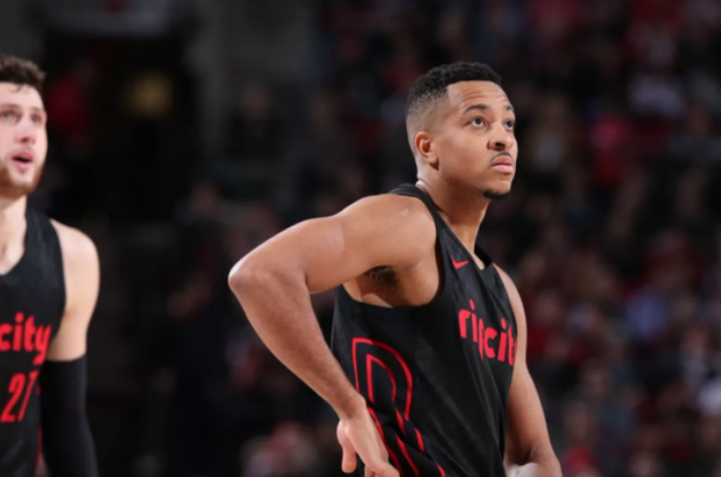

从某种程度上来说，我很庆幸当时没人在，自己可以最后一次看看更衣室并把东西一次拉走。因为我觉得如果撞见队友，我可能会不知所措。有趣的是，当利拉德看到椅子上的球衣时，他给我发来短信：“该死！兄弟，你把我弄哭了！”

我们不能让利拉德哭，年轻人们见不得这样的场面，这会像见到电影中的大反派哭一样。

要知道，我和利拉德真的是在这个地方一同成长的。现在回想起来仍然感觉疯狂，刚入联盟的第一年，每次去客场时，我们都会在早上的投篮训练后用最快的速度洗完澡，然后穿着队服直接去商场。

没有午休，不带保安，啥都不带，就像两个小孩子逃学一样。我们会在旧金山、休斯顿或其他某地的商店里逛几个小时，随意窜进一家店。那是在我们签下大合同之前，因此我指的是一些中端店铺。

我们会跟店家讨价还价，打7折，如果打7折就买。我们总会去Macy百货看看那里有什么，可能会要一杯冰沙，或是一个软椒盐卷饼。

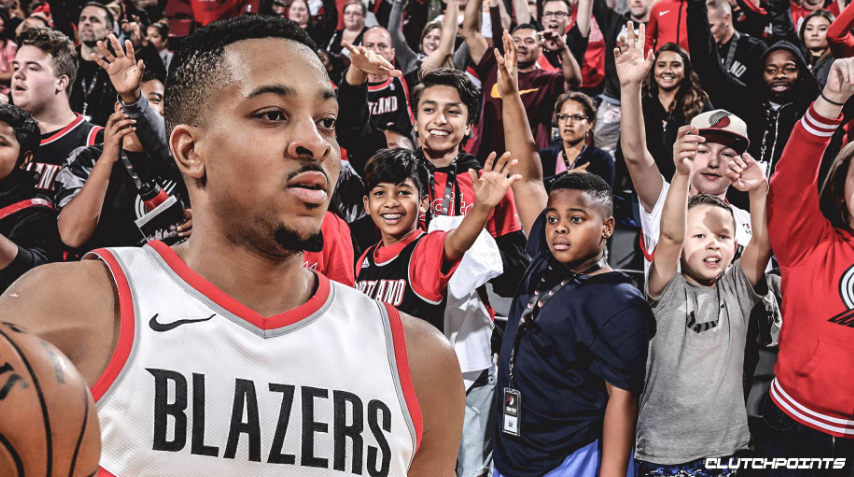

记得在新秀赛季，我特别想买一只手表，但那对我来说太贵了，好像是3000美元吧。我怕买了会破产，以至于一次次地到柜台与店员讨价还价，心态大概是，下次吧，下次一定买。

达米安总是跟我说，“老哥，买下那块表吧，你可是在NBA打球。”

而我则说：“兄弟，我可不想在20年后破产！”所以我把我的客场工资都存了起来，大概存了有两个月吧，最终我用这笔钱以5折的价格买下了那块手表。

我还记得让店员刷我银行卡时那种忐忑不安的心情。如果想笑你就尽管笑吧，反正这块表仍对我意义非凡，我到现在也还留着它。它让我想起自己的少年时光，彼时我对NBA，对这座城市，对每样事物都感到无比新鲜。

 

我和达米安曾经穿着开拓者队服在街上连逛几个小时而不被人认出。有时我们会赶回酒店径直坐上前往球馆的巴士，手里提着一堆购物袋，那时队里的老同志们会瞪着我们，像是对我们很不耐烦。

有趣的是，现在的我无法想象，白天逛3个小时街晚上再打35分钟比赛会怎么样。我需要休息、冥想、拉伸、恢复。

想到自己已经改变了那么多，这太疯狂了。现在每次投篮训练后，我和达米安通常都是和自己的儿子视频聊天。但当你年轻时，生活就像一部电影，就像活在梦里一样。

我记得达米安开始在街上被人们认出来的时候，我还是个无名之辈。当时我心里想的是，啥时候能有人认出我来啊？啥时候我才能看到有小孩穿着3号球衣？

记得在我的第二个赛季，我还没进入首发。我清楚地记得有一天我对达米安说：“在这里我永远没机会首发。为什么他们要选我？我搞不明白。”

达米安的表情像是“你疯了吗”一样，然后跟我说：“大哥你想啥呢？总有一天我们会成为后场组合。我们会在这儿打很久，我们会改变这个地方。你会见证这一切的。”

我说：“你说的这些我都不信。”他说：“你会相信的。”

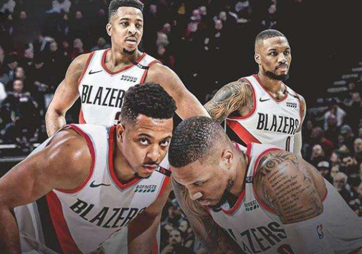

那年季后赛，我在对灰熊的比赛中得到33分，达米安赛后跑向我。

“看到没有？我是怎么跟你说的？我们会并肩作战，一起拼下去。”他有那样的愿景，我不知道他是怎么看到的，但他做到了。

如果没有我的队友们，这一切将毫无意义。这些年来，如果没有那些值得信赖的队友们，这一切就真的只是生意。小莫、厄尔-沃特森、多雷尔-怀特、埃文-特纳、哈克利斯、卡曼、沙巴兹、阿德等等，在他们的帮助下我得以不断前行。

当然还有努尔基奇，我不会忘记大个子努尔基奇，我一生的波黑兄弟。

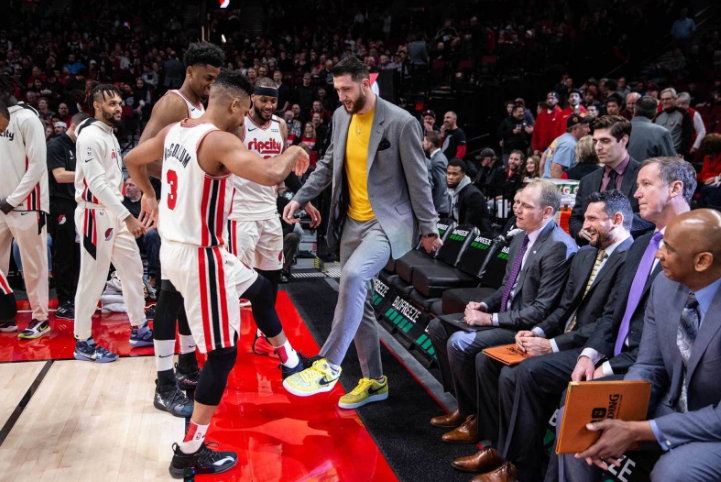

我永远不会忘记2019年他因腿部骨折整天窝在沙发，我经常会与他视频通话以确保他的情况。后来有一天，我决定拜访他家。当我走进屋里时，我听到的只有电视里传来的胡言乱语，然后他就把频道调到体育频道什么的。

我当时说：“兄弟，别介意我。这里是你家，我们看点你平时看的东西就好。”他问我：“你确定你想看我看的？”我说：“当然，为什么不呢？”

然后他就向我安利波黑的电视，没有字幕的那种，我猜都是些肥皂剧情，但可能也是喜剧？

有一位杂工，他在追求一位年轻的女人，这似乎是主要的情节，但然后他们又会翻转剧情，加入各种疯狂的片段。

我不停转头看向努尔基奇：“好吧，所以现在主人公是一位机修工人？他想追求那个女孩，还是说...”

我本以为那是一部严肃正剧，但随后努尔基奇就开始大笑和看向我，好像在说，“是不是很有趣？”这家伙疯了。

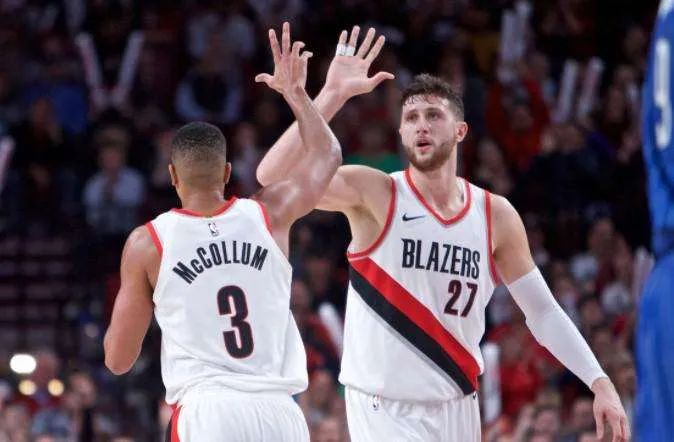

时不时地，努尔基奇家昂贵的进口猫会在房子里游荡，而他喝着他习惯的日常7到10杯咖啡。当你去努尔基奇家的时候，就是这种氛围。

他抚摸着猫，告诉我：“你得装一个宠物摄像机。我要给你买一个。”（然后他真的买了。）

被交易后，我打电话告诉他我在他椅子上留了一件球衣，而他说：“我已经有一件了。”我很惊讶：“啥意思？”

他说：“是的，你的上一场比赛结束后我从器材室偷了一件。”

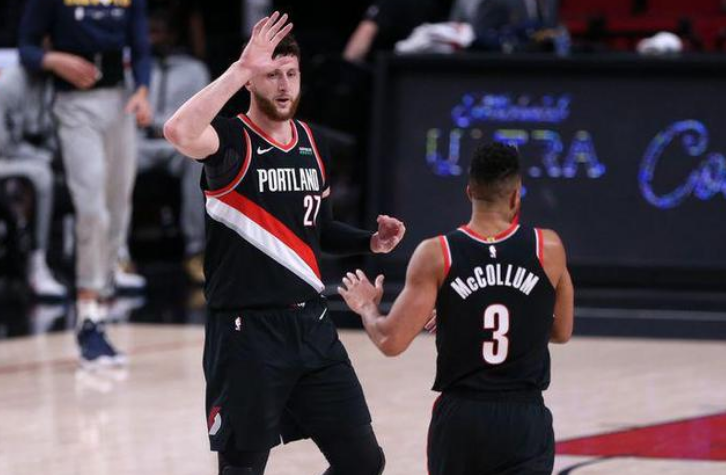

朋友们，这就是我的队友们。他们在我心里就是这样，不是赢家或输家，而是我的队友。当我写下这封信时，这些回忆不断在我的脑海中闪现。事实就是这样的。

我想到有一年夏天在拉斯维加斯，我和达米安早上6点起来出门工作，只睡了4个小时。我想到了努尔基奇为我做的那些完美挡拆。但坦白说，现在涌上我心头的是那些平凡的小事，比如那天和努尔基奇看波黑电视节目。

有一年，达米安邀请我一起过感恩节，他父亲给我做了炖牛尾。我和蒂姆-弗雷泽第一次在一个葡萄园里品尝真正的俄勒冈黑皮诺。我第一次在Ringside餐厅品尝火山土。

每场比赛后我们都会去Departure餐厅吃饭，每晚都坐同一张大桌子。新秀赛季每个早上都在堵车中汗流浃背，因为阿德要让我去给他买Krispy Kreme的甜甜圈。

阿德还给我500美元让我即兴表演，并让我别告诉马修斯和巴图姆，这样我还可以从他们身上赚钱。（阿德，你是真正的MVP！）

训练后我会收到多雷尔-怀特的短信，“下楼菜鸟，我带你去吃饭。”（现在，我也成为了那个照顾新秀的人。）

都是诸如此类的小事。

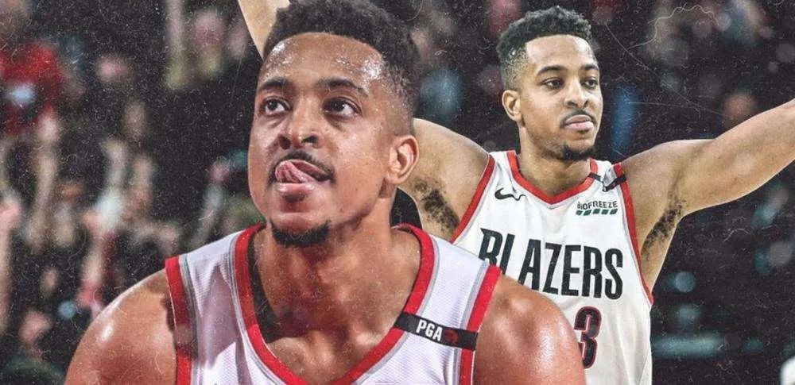

西决被勇士横扫后，第一次来到波特兰市中心时，心里不确定这座城市会怎样对待我。但无数人走上前来说，“嘿，我想谢谢你们，那是一次轮令人敬畏的系列赛，我们爱你。”

我想说的是，我们被横扫了，但整个夏天我们都没有付过一次晚餐钱。这里的氛围太好了。人们非常感激我们能改变球队的心气。这就是波特兰对我的意义——人们不完全把我当成篮球运动员对待，他们把我当成自己社区的一份子。

对我来说，波特兰不只是一件球衣、一个球队这么简单的事，这里是我的家。我在这儿娶妻生子，开始自己的人生。我真的是将自己的根扎在这里。我的一部分将永远留在俄勒冈州，尤其是我的社区工作。我为我人生的下一个篇章感到兴奋，但别担心，我心永恒。

我不会离开！不会，这里永远是我们的第二故乡。

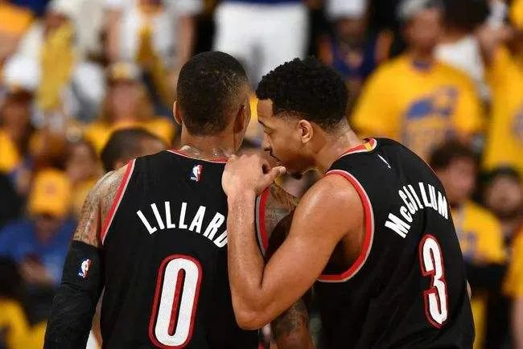

在获悉交易的那天早上，当我坐在那儿思考接下来该做什么时，四周万籁俱寂。

我对妻子说：“你知道最好的是什么吗？这次分手并不丑陋。这个地方对我们一直很好，我们带着好的条件离开。你还能要求什么？”

我想去新奥尔良，这是真正能弥补疼痛的事情。作为一名纯粹的篮球运动员，我很兴奋能与锡安、英格拉姆、瓦兰丘纳斯以及所有那里的年轻人一起打球。

我真的觉得我表现出了足够多的职业精神和准备，因为在9年的时间里，我已经看透了联盟的一切。我经历过DNP，经历过质疑和嘲讽，经历过抢七，赢过也输过。

 

当你还是联盟里的年轻人时，你不知道什么是你不知道的——请接受我这位曾经整天逛商场的过来人的话，我认为我能给新奥尔良带来许多智慧。

作为一个普通人，我真的很兴奋能搬到那座城市去路易斯安娜超级巨蛋看一些橄榄球比赛。（虽然我的儿子从小就被培养为克利夫兰布朗队球迷，对此我很抱歉。）

在经历所有的流言蜚语后，交易最终完成了。没有闹剧，没有废话，完全的职业化。我还能再要求什么？

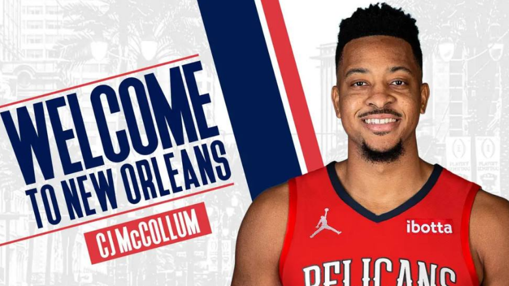

致波特兰的每一个人，致我的队友、球队、球迷，致整个社区。谢谢你们，这是我发自肺腑的感谢。

我会在另外的地方关注你们。

我们的关系已如此之深，无法用言语表达。比胜利更重要，比球场上发生的一切更重要。对我来说，这是9年的欢笑、伤病、心碎、快乐以及精神成长。这是我的全部。

那天结束时，当我回想起这些，想到我们作为一支球队有如此深的感情，感觉很疯狂。在一个偏处西海岸一隅的小球市，我们制造了很多轰动，也制造了很多回忆。我们保持忠诚，每一天都用真心代表着这座城市。

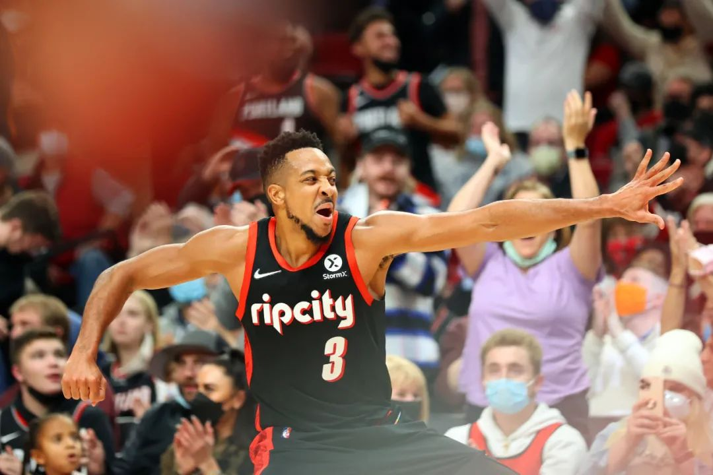

我会永远为此自豪。

也许我们没有实现我们的终极目标。篮球如此，人生亦然。但该死的，如果不试试怎么知道！

——爱你们的，CJ

*注：文章图片转自公众号《篮球技巧教学》*