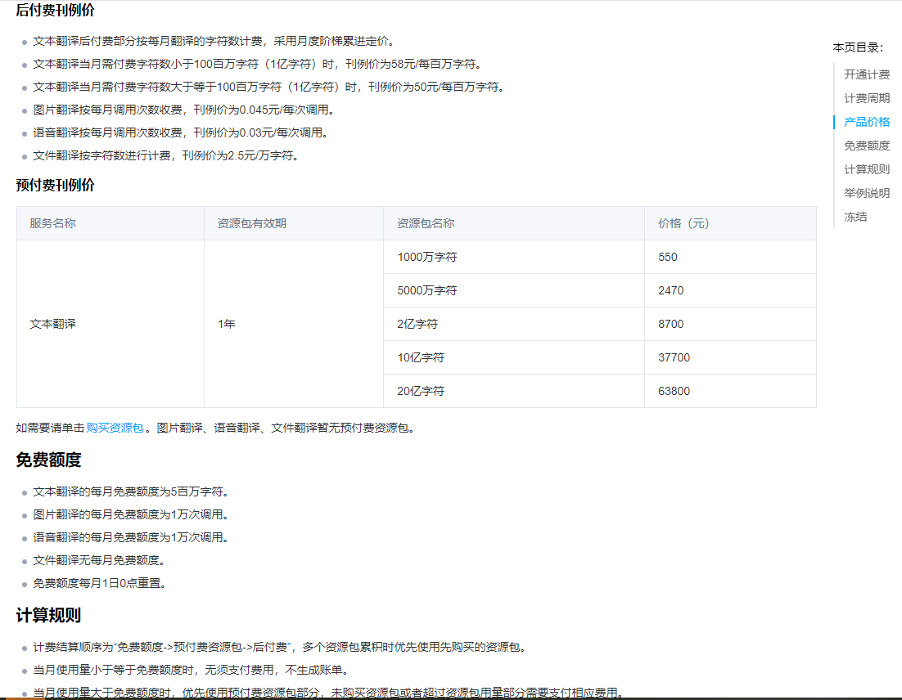

### 背景及设计思路

> 在做接口开发的时候给客户端的响应需要根据不同的语言返回对应的结果，主要核心内容有两点：

- 返回结果做多语言转换
- 接口进行统一处理

### 各厂商翻译sdk集成示例

#### 1. 腾讯云翻译

1.1 引入腾讯云sdk

```java
<!--	腾讯云sdk-->
  <dependency>
   <groupId>com.tencentcloudapi</groupId>
   <artifactId>tencentcloud-sdk-java</artifactId>
   <version>3.0.29</version>
  </dependency>
```

1.2 实现多语言翻译工具类

登录腾讯云平台 -> 搜索机器翻译 -> 资源包 -> 创建资源-> 点击用户头像-> 访问管理 -> 获取密钥

代码：

```java
package org.jeecg.modules.dzcloud.utils;

import com.tencentcloudapi.common.Credential;
import com.tencentcloudapi.common.exception.TencentCloudSDKException;
import com.tencentcloudapi.common.profile.ClientProfile;
import com.tencentcloudapi.common.profile.HttpProfile;
import com.tencentcloudapi.tmt.v20180321.TmtClient;
import com.tencentcloudapi.tmt.v20180321.models.TextTranslateRequest;
import com.tencentcloudapi.tmt.v20180321.models.TextTranslateResponse;

/**
 * @Description
 * @Author Jay
 * @Date 2023/7/14 16:47
 **/
public class TranslateUtils {

    /**
     *
     * @param sourceText 带翻译文本
     * @param source 原语言
     * @param target 目标语言
     * @return
     */
    public static String textTranslate(String sourceText, String source, String target) {
        try {
            // 设置腾讯云 API 密钥
            Credential cred = new Credential("AKIDPze6MTZTBpOsRB0f8RcaSYQH0X4XwALS", "ELGAvdPTehjdnupdEdAXlDdQMEAzazSq");

            // 创建 HTTP 参数配置
            HttpProfile httpProfile = new HttpProfile();
            httpProfile.setEndpoint("tmt.tencentcloudapi.com"); // 设置 API 地域

            // 创建客户端配置
            ClientProfile clientProfile = new ClientProfile();
            clientProfile.setHttpProfile(httpProfile);

            // 创建翻译客户端
            TmtClient client = new TmtClient(cred, "ap-guangzhou", clientProfile);

            // 创建翻译请求
            TextTranslateRequest request = new TextTranslateRequest();
            request.setSourceText(sourceText);
            request.setSource(source);
            request.setTarget(target);
            request.setProjectId(0); // 可选的项目 ID

            // 发送翻译请求
            TextTranslateResponse response = client.TextTranslate(request);

            // 返回翻译结果
            return response.getTargetText();
        } catch (TencentCloudSDKException e) {
            e.printStackTrace();
            return e.getMessage();
        }

    }

}
```

1.3 调用结果示例

调用：

```java
header: {
    "X-Lang-Target": "ja", //目标语言，日语
}
params: {
    "text": "你好",
}
```

返回:

```java
{
    "success": true,
    "message": "こんにちは",
    "code": 0,
    "result": null,
    "timestamp": 1689557575076
}
```

1.4 费用标准



#### 2. 百度翻译

2.1 登录百度翻译开放平台

百度翻译开放平台 -> 实名认证 -> 通用文本翻译 -> 获取示例 -> 控制台获取密钥

2.2 实现翻译工具类

TransApi

```java
package org.jeecg.modules.dzcloud.utils;

import java.util.HashMap;
import java.util.Map;

public class TransApi {
    private static final String TRANS_API_HOST = "http://api.fanyi.baidu.com/api/trans/vip/translate";

    private static final String appid = "20230721001752118";
    private static final String securityKey = "YaQXjifwr97DppPk_v0K";

//    public TransApi(String appid, String securityKey) {
//        this.appid = appid;
//        this.securityKey = securityKey;
//    }

    /**
     *
     * @param query 待翻译文本
     * @param from 原语言
     * @param to 目标语言
     * @return
     */
    public static String getTransResult(String query, String from, String to) {
        Map<String, String> params = buildParams(query, from, to);
        return HttpGet.get(TRANS_API_HOST, params);
    }

    private static Map<String, String> buildParams(String query, String from, String to) {
        Map<String, String> params = new HashMap<String, String>();
        params.put("q", query);
        params.put("from", from);
        params.put("to", to);

        params.put("appid", appid);

        // 随机数
        String salt = String.valueOf(System.currentTimeMillis());
        params.put("salt", salt);

        // 签名
        String src = appid + query + salt + securityKey; // 加密前的原文
        params.put("sign", MD5.md5(src));

        return params;
    }

}
```

MD5工具类

```java
package org.jeecg.modules.dzcloud.utils;

import java.io.*;
import java.security.MessageDigest;
import java.security.NoSuchAlgorithmException;

/**
 * MD5编码相关的类
 * 
 * @author wangjingtao
 * 
 */
public class MD5 {
    // 首先初始化一个字符数组，用来存放每个16进制字符
    private static final char[] hexDigits = { '0', '1', '2', '3', '4', '5', '6', '7', '8', '9', 'a', 'b', 'c', 'd',
            'e', 'f' };

    /**
     * 获得一个字符串的MD5值
     * 
     * @param input 输入的字符串
     * @return 输入字符串的MD5值
     * 
     */
    public static String md5(String input) {
        if (input == null)
            return null;

        try {
            // 拿到一个MD5转换器（如果想要SHA1参数换成”SHA1”）
            MessageDigest messageDigest = MessageDigest.getInstance("MD5");
            // 输入的字符串转换成字节数组
            byte[] inputByteArray = input.getBytes("utf-8");
            // inputByteArray是输入字符串转换得到的字节数组
            messageDigest.update(inputByteArray);
            // 转换并返回结果，也是字节数组，包含16个元素
            byte[] resultByteArray = messageDigest.digest();
            // 字符数组转换成字符串返回
            return byteArrayToHex(resultByteArray);
        } catch (NoSuchAlgorithmException | UnsupportedEncodingException e) {
            return null;
        }
    }

    /**
     * 获取文件的MD5值
     * 
     * @param file
     * @return
     */
    public static String md5(File file) {
        try {
            if (!file.isFile()) {
                System.err.println("文件" + file.getAbsolutePath() + "不存在或者不是文件");
                return null;
            }

            FileInputStream in = new FileInputStream(file);

            String result = md5(in);

            in.close();

            return result;

        } catch (FileNotFoundException e) {
            e.printStackTrace();
        } catch (IOException e) {
            e.printStackTrace();
        }

        return null;
    }

    public static String md5(InputStream in) {

        try {
            MessageDigest messagedigest = MessageDigest.getInstance("MD5");

            byte[] buffer = new byte[1024];
            int read = 0;
            while ((read = in.read(buffer)) != -1) {
                messagedigest.update(buffer, 0, read);
            }

            in.close();

            String result = byteArrayToHex(messagedigest.digest());

            return result;
        } catch (NoSuchAlgorithmException e) {
            e.printStackTrace();
        } catch (FileNotFoundException e) {
            e.printStackTrace();
        } catch (IOException e) {
            e.printStackTrace();
        }

        return null;
    }

    private static String byteArrayToHex(byte[] byteArray) {
        // new一个字符数组，这个就是用来组成结果字符串的（解释一下：一个byte是八位二进制，也就是2位十六进制字符（2的8次方等于16的2次方））
        char[] resultCharArray = new char[byteArray.length * 2];
        // 遍历字节数组，通过位运算（位运算效率高），转换成字符放到字符数组中去
        int index = 0;
        for (byte b : byteArray) {
            resultCharArray[index++] = hexDigits[b >>> 4 & 0xf];
            resultCharArray[index++] = hexDigits[b & 0xf];
        }

        // 字符数组组合成字符串返回
        return new String(resultCharArray);

    }

}
```

HttpGET

```java
package org.jeecg.modules.dzcloud.utils;

import java.io.BufferedReader;
import java.io.Closeable;
import java.io.IOException;
import java.io.InputStream;
import java.io.InputStreamReader;
import java.io.UnsupportedEncodingException;
import java.net.HttpURLConnection;
import java.net.MalformedURLException;
import java.net.URL;
import java.net.URLEncoder;
import java.security.KeyManagementException;
import java.security.NoSuchAlgorithmException;
import java.security.cert.CertificateException;
import java.security.cert.X509Certificate;
import java.util.Map;

import javax.net.ssl.HttpsURLConnection;
import javax.net.ssl.SSLContext;
import javax.net.ssl.TrustManager;
import javax.net.ssl.X509TrustManager;

class HttpGet {
    protected static final int SOCKET_TIMEOUT = 10000; // 10S
    protected static final String GET = "GET";

    public static String get(String host, Map<String, String> params) {
        try {
            // 设置SSLContext
            SSLContext sslcontext = SSLContext.getInstance("TLS");
            sslcontext.init(null, new TrustManager[] { myX509TrustManager }, null);

            String sendUrl = getUrlWithQueryString(host, params);

            // System.out.println("URL:" + sendUrl);

            URL uri = new URL(sendUrl); // 创建URL对象
            HttpURLConnection conn = (HttpURLConnection) uri.openConnection();
            if (conn instanceof HttpsURLConnection) {
                ((HttpsURLConnection) conn).setSSLSocketFactory(sslcontext.getSocketFactory());
            }

            conn.setConnectTimeout(SOCKET_TIMEOUT); // 设置相应超时
            conn.setRequestMethod(GET);
            int statusCode = conn.getResponseCode();
            if (statusCode != HttpURLConnection.HTTP_OK) {
                System.out.println("Http错误码：" + statusCode);
            }

            // 读取服务器的数据
            InputStream is = conn.getInputStream();
            BufferedReader br = new BufferedReader(new InputStreamReader(is));
            StringBuilder builder = new StringBuilder();
            String line = null;
            while ((line = br.readLine()) != null) {
                builder.append(line);
            }

            String text = builder.toString();

            close(br); // 关闭数据流
            close(is); // 关闭数据流
            conn.disconnect(); // 断开连接

            return text;
        } catch (MalformedURLException e) {
            e.printStackTrace();
        } catch (IOException e) {
            e.printStackTrace();
        } catch (KeyManagementException e) {
            e.printStackTrace();
        } catch (NoSuchAlgorithmException e) {
            e.printStackTrace();
        }

        return null;
    }

    public static String getUrlWithQueryString(String url, Map<String, String> params) {
        if (params == null) {
            return url;
        }

        StringBuilder builder = new StringBuilder(url);
        if (url.contains("?")) {
            builder.append("&");
        } else {
            builder.append("?");
        }

        int i = 0;
        for (String key : params.keySet()) {
            String value = params.get(key);
            if (value == null) { // 过滤空的key
                continue;
            }

            if (i != 0) {
                builder.append('&');
            }

            builder.append(key);
            builder.append('=');
            builder.append(encode(value));

            i++;
        }

        return builder.toString();
    }

    protected static void close(Closeable closeable) {
        if (closeable != null) {
            try {
                closeable.close();
            } catch (IOException e) {
                e.printStackTrace();
            }
        }
    }

    /**
     * 对输入的字符串进行URL编码, 即转换为%20这种形式
     * 
     * @param input 原文
     * @return URL编码. 如果编码失败, 则返回原文
     */
    public static String encode(String input) {
        if (input == null) {
            return "";
        }

        try {
            return URLEncoder.encode(input, "utf-8");
        } catch (UnsupportedEncodingException e) {
            e.printStackTrace();
        }

        return input;
    }

    private static TrustManager myX509TrustManager = new X509TrustManager() {

        @Override
        public X509Certificate[] getAcceptedIssuers() {
            return null;
        }

        @Override
        public void checkServerTrusted(X509Certificate[] chain, String authType) throws CertificateException {
        }

        @Override
        public void checkClientTrusted(X509Certificate[] chain, String authType) throws CertificateException {
        }
    };

}
```

2.3 调用结果示例

调用：

```java
header: {
    "X-Lang-Target": "ja", //目标语言，日语
}
params: {
    "text": "你好",
}
```

返回:

```java
"{\"from\":\"zh\",\"to\":\"jp\",\"trans_result\":[{\"src\":\"\你\好\",\"dst\":\"\こ\ん\に\ち\は\"}]}"
```

2.4 费用示例

通用翻译API产品定价

标准价格：
通用翻译API 按照字符量付费。

- 标准版：
每月前5万字符免费，超出仅收取超出部分费用（QPS=1），按49元/百万字符计费；

- 高级版：
每月前100万字符免费，超出仅收取超出部分费用（QPS=10），按49元/百万字符计费；

- 尊享版：
每月前200万字符免费，超出后仅收取超出部分费用（QPS=100），按49元/百万字符计费；

*数据来自官网*

#### 3. 有道翻译

3.1 登录有道翻译开放平台

有道翻译开放平台 -> 实名认证 -> 文本翻译 -> 创建应用 -> 控制台获取密钥 -> 获取示例

3.2 实现翻译工具类

```java
package org.jeecg.modules.dzcloud.utils.youdao;


import java.nio.charset.StandardCharsets;
import java.security.NoSuchAlgorithmException;
import java.util.HashMap;
import java.util.Map;

/**
 * 网易有道智云翻译服务api调用demo
 * api接口: https://openapi.youdao.com/api
 */
public class TranslateDemo {

    private static final String APP_KEY = "09aab0c277088486";     // 您的应用ID
    private static final String APP_SECRET = "oN3Sah3t3xtaT6eVEaRKj2saZQRfou2q";  // 您的应用密钥

    public static String getTransResult(String query, String from, String to) {
        // 添加请求参数
        Map<String, String[]> params = createRequestParams(query, from, to);
        // 添加鉴权相关参数
        try {
            AuthV3Util.addAuthParams(APP_KEY, APP_SECRET, params);
        } catch (NoSuchAlgorithmException e) {
            e.printStackTrace();
        }
        // 请求api服务
        byte[] result = HttpUtil.doPost("https://openapi.youdao.com/api", null, params, "application/json");
        // 打印返回结果
        if (result != null) {
            return  new String(result, StandardCharsets.UTF_8);
        } else {
            return "";
        }
    }

    private static Map<String, String[]> createRequestParams(String query, String from, String to) {
        /*
         * note: 将下列变量替换为需要请求的参数
         * 取值参考文档: https://ai.youdao.com/DOCSIRMA/html/%E8%87%AA%E7%84%B6%E8%AF%AD%E8%A8%80%E7%BF%BB%E8%AF%91/API%E6%96%87%E6%A1%A3/%E6%96%87%E6%9C%AC%E7%BF%BB%E8%AF%91%E6%9C%8D%E5%8A%A1/%E6%96%87%E6%9C%AC%E7%BF%BB%E8%AF%91%E6%9C%8D%E5%8A%A1-API%E6%96%87%E6%A1%A3.html
         */

        String vocabId = "您的用户词表ID";

        return new HashMap<String, String[]>() {{
            put("q", new String[]{query});
            put("from", new String[]{from});
            put("to", new String[]{to});
        }};
    }
}
```

*上述方法所用其它工具类可于官网获取*

3.3 调用结果示例

调用：

```java
header: {
    "X-Lang-Target": "ja", //目标语言，日语
}
params: {
    "text": "你好",
}
```

返回:

```java
{\"tSpeakUrl\":\"https://openapi.youdao.com/ttsapi?q=%E3%81%93%E3%82%93%E3%81%AB%E3%81%A1%E3%81%AF&langType=ja&sign=B20436FE22B5A96B1965327BAD578B27&salt=1689919686501&voice=4&format=mp3&appKey=09aab0c277088486&ttsVoiceStrict=false&osType=api\",\"requestId\":\"b7b816b8-61b3-478e-bc06-f5669a6736a0\",\"query\":\"你好\",\"translation\":[\"こんにちは\"],\"mTerminalDict\":{\"url\":\"https://m.youdao.com/m/result?lang=zh-CHS&word=%E4%BD%A0%E5%A5%BD\"},\"errorCode\":\"0\",\"dict\":{\"url\":\"yddict://m.youdao.com/dict?le=eng&q=%E4%BD%A0%E5%A5%BD\"},\"webdict\":{\"url\":\"http://mobile.youdao.com/dict?le=eng&q=%E4%BD%A0%E5%A5%BD\"},\"l\":\"zh-CHS2ja\",\"isWord\":false,\"speakUrl\":\"https://openapi.youdao.com/ttsapi?q=%E4%BD%A0%E5%A5%BD&langType=zh-CHS&sign=79238E9778353E194FAD9494A4CD97DA&salt=1689919686501&voice=4&format=mp3&appKey=09aab0c277088486&ttsVoiceStrict=false&osType=api\"}
```

2.4 费用示例

- 免费体验
    对于自然语言翻译服务，各接口拥有一定量的免费查询字符数（新用户注册账户时，系统会向您账户赠予50元体验资金），可免费体验有道智云的服务。
    说明：

    先消费体验金额，体验金额耗尽后，才根据接口调用量在账户余额进行扣费。
    单次查询最大字符数默认为5000、每小时最大查询次数默认为100万。如无法满足您的需求，可联系我们，我们会评估您的需求，并做出适当调整。

- 文本翻译价目表
    本产品有预付费和后付费两种付费方式：

    预付费是指先购买资源包再使用本产品服务。用户在用预付费方式购买本产品时，需提前购买不同配额的资源包。
    后付费是指按量付费的模式，其中不同语种收费不同，具体计费规则参考按量计费的价目表。如消耗了100w字符（中文到常见语种的互译），则扣费48元；其他情况则扣费100元。
    月初，上月累计的调用量清零，重新开始记录本月调用量。资源包内调用量配额不计入按量计费模式的阶梯中。本服务开通后默认选择按量付费模式，购买资源包后优先消耗资源包配额，当资源包内调用次数消耗完毕或资源包过期失效后，自动转为按量计费模式。

|  表头   | 表头  | 服务内容 | 价格（元/百万字符） |
|  ----  | ----  | ---- | ---- |
| 通用版本  | 按月调用字符数 | 常见语种互译（部分除外） | 48 |
| 通用版本  | 按月调用字符数 | 中文与非常见语种互译 | 100 |
| 通用版本  | 按月调用字符数 | 其他语种间互译 | 100 |
| 专业领域  | 按月调用字符数 | 中英文互译 | 60 |

*数据来源于官网*

### aop切面统一处理,实现返回结果拦截翻译再返回,直接上代码

```java
import lombok.AllArgsConstructor;
import org.apache.commons.lang3.StringUtils;
import org.aspectj.lang.JoinPoint;
import org.aspectj.lang.annotation.AfterReturning;
import org.aspectj.lang.annotation.Aspect;
import org.aspectj.lang.annotation.Pointcut;
import org.springblade.core.tool.api.R;
import org.springframework.boot.autoconfigure.condition.ConditionalOnProperty;
import org.springframework.core.io.ClassPathResource;
import org.springframework.core.io.Resource;
import org.springframework.stereotype.Component;
import org.springframework.web.context.request.RequestAttributes;
import org.springframework.web.context.request.RequestContextHolder;
 
import javax.servlet.http.HttpServletRequest;
import java.io.BufferedReader;
import java.io.InputStream;
import java.io.InputStreamReader;
import java.util.Map;
import java.util.Objects;
import java.util.concurrent.ConcurrentHashMap;
 
/**
 * 对请求参数进行拦截修改
 * @author
 */
@Aspect
@Component
@AllArgsConstructor
@ConditionalOnProperty(prefix = "lang",name = "open",havingValue = "true")
public class LanguageAspect {
 
 private String objPreFix = "R";
 
 @Pointcut("execution(* com.rksj.controller.*.*(..))")
 public void annotationLangCut(){};
 
 /**
  * 定义一个并发性Map用来存放信息
  */
 Map<String, String> tmpMap = new ConcurrentHashMap<>();
 
 /**
  * 在构造函数中进行初始化，后面可从配置文件中初始化
  */
 public LanguageAspect(){
  //初始化 KEY为简体  VALUE为  简体###繁体###英文
  loadSysCfg();
 
 }
 
 /**
  * 从配置文件加载
  */
 private void loadSysCfg(){
  try{
   //加载配置文件
   Resource resource = new ClassPathResource("language");
   InputStream is = resource.getInputStream();
   InputStreamReader inputStreamReader = new InputStreamReader(is);
   BufferedReader bufferedReader = new BufferedReader(inputStreamReader);
   String line = "";
   while( (line = bufferedReader.readLine()) != null ){
    //不为空且以#号开头的去掉，注释部分
    if(StringUtils.isNotEmpty(line) && !line.startsWith("#")){
     String[] lines = line.split("###");
     tmpMap.put(lines[0], line);
    }
   }
  }catch (Exception e){
   e.printStackTrace();
  }
 }
 
 
 
 /**
  * 拦截controller层返回的结果，修改msg字段
  * @param point
  * @param obj
  */
 @AfterReturning(pointcut="annotationLangCut()",returning="obj")
 public void around(JoinPoint point, Object obj)  {
  Map<String, String> map = new HashMap<String, String>();
  Object backObj = obj;
  try{
   RequestAttributes requestAttributes = RequestContextHolder.getRequestAttributes();
   //从获取RequestAttributes中获取HttpServletRequest的信息
   HttpServletRequest request = (HttpServletRequest) requestAttributes.resolveReference(RequestAttributes.REFERENCE_REQUEST);
   String bladeLang = request.getHeader("x-language");
   String targetTxt = TranslateUtils.textTranslate(obi.JSON.toJSONString(), "auto" ,bladeLang);
   obj = JSON.parseObject(targetTxt);
   }
  }catch (Exception e){
   e.printStackTrace();
   //重新赋值给obj，防止try中途修改原始的值
   obj = backObj;
  }
```
